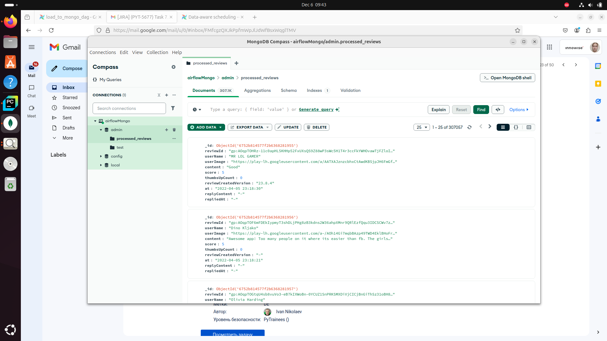

# Big-Data

### DAG convert file

### DAG add data to mongo

### Data in MongoDB

### Query1 (Top 5 most frequent comments)

### Query2 (All entries where the length of the “content” field is less than 5 characters)

### Query3 (Average rating for each day)

